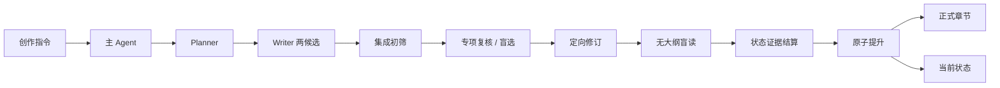

<p align="center">
  
</p>

# 《神秘复苏前传：张洞传》

以张洞为主角的非官方前传，以及一套由 Planner、Writer、Reviewer 协作、可由任意 Agent 执行的长篇创作系统。

> 从一座封着疑棺的旧祠堂开始，沿着鬼邮局、民国驭鬼者与七老留下的痕迹，写完一条从辛亥前后延伸至杨间时代的灵异时间线。

仓库同时存放连载正文和创作协议。当前章号、人物、时间和伏笔集中在一份状态文件中；规划、写作、审查分角色执行，通过后章节、元数据与状态一起写入。Python 只做确定性校验、工件匿名化和事务性提升，不启动任何 Agent 命令。

任意 Agent 从 [通用 Agent 工作流](WORKFLOW.md) 进入；状态机、质量门禁、恢复方式和完整命令见 [创作引擎手册](init.md)。

## 引擎与故事已解耦

根目录 [`project.json`](project.json) 只负责选择默认故事。通用管线使用 [`config/engine_config.json`](config/engine_config.json)；张洞的主角、年代、卷结构、剧情路径和角色叠加由 [`stories/zhangdong/project.json`](stories/zhangdong/project.json) 与 [`stories/zhangdong/story_config.json`](stories/zhangdong/story_config.json) 声明；灵异悬疑专用审计位于 [`profiles/horror-mystery/`](profiles/horror-mystery/)。

引擎不再把 `novel/`、张洞、1911 或灵异词表当作固定运行前提。一个当代气象站现实题材项目作为自动化验收样例，能在不修改 Python 的情况下通过完整预检。项目清单、配置合并、角色覆盖和新建故事包方法见 [创作引擎与故事包](docs/project-packages.md)。

## 故事

故事从1911年前后的双桥镇开始。约十七岁的张洞尚未拥有后来压制一代驭鬼者的力量；他先要从一套会指定活人守位的家族制度中保住家人，再亲手寻找不靠牺牲守位者的限制办法。

地理上，正文使用原著虚构市名“大汉市”统摄现实武汉三镇及其后续城市空间；武昌、汉口、汉阳、江岸作为具体历史片区出现，“大汉市”和“武汉”不另写成两座城市。

| 卷 | 预估章数 | 年代 | 主线 |
|---|---:|---:|---|
| 门外 | 55—70 | 1911—1914 | 从家族守位制度中活下来，主动寻找不靠牺牲活人的办法 |
| 无主信 | 75—95 | 1914—1927 | 与罗文松从路线冲突走向有限合作，首次主动承担抹除代价 |
| 不同的门 | 105—130 | 1928—1937 | 双桥旧木造成的错门事件串起核心人物，七人在弘法寺门后完成第一次共同限制 |
| 无人守得住 | 90—115 | 1937—1945 | 固定封存面对战争迁徙失效，团队因代价分配而分裂 |
| 留给后来人 | 75—100 | 1945—1953 | 江岸接收总栈终局拆分三段灾链，留下仍需活人维护、可被后来者拒绝的有限遗产 |
| 守到后来 | 45—65 | 1954年至杨间时代 | “最后一个无人接班的位置”随成员退出持续恶化，红门会面与古宅葬礼完成正典交接 |

六卷主事件、七老关系、能力代价与通向原著的留白，见 [全书剧情圣经](novel/plots/full_series_plot_bible.md)。灵异底层规则见 [创作规则全书](novel/rules/rulebook.md)。

## 当前进度

正式连载已按1911年、十七岁张洞重启。章号、事件、年代和已提升正文以 [`novel/state/current.json`](novel/state/current.json) 与 [`novel/chapters/`](novel/chapters/) 为准，不在本文件维护副本。撤出的旧稿见 [`novel/archive/`](novel/archive/)。

- [第一卷正式章节](novel/chapters/vol_01/)
- [连续阅读合订本](novel/full_novel.txt)
- [张洞人物卡](novel/characters/protagonist.md)
- [事件大纲](novel/plots/)
- [六卷时间线](novel/timeline.md)
- [伏笔追踪表](novel/foreshadow_tracker.md)

## 创作管线



未达门禁的尝试只留在工作区，不改正式内容。默认平衡模式把全部模型调用限制在 12 次以内，不做无条件补写或外层重新规划。

另有一条与正式管线隔离的[场景生成机制实验](workflows/scene-generation-experiment.md)：同一事实锁下比较“先规划完整结果”“角色行动后结算”“结算后滚动修订”三种路线。模拟路线先生成有限认知的角色意图，再由世界结算器确定后果，Writer 只读取经过 POV 过滤的可见事件；三份正文最终匿名交给用户，不自动修改正典。

## 开始使用

需要 Git，以及任意能读取仓库并遵循 Markdown/JSON 契约的 Agent。Python 3.10+ 可选。

```bash
git clone https://github.com/cyanrbt/novel-prequel.git
cd novel-prequel
```

告诉当前 Agent：

```text
阅读 WORKFLOW.md，执行 status-check。
```

当前正向文风画像仍是 `CALIBRATING`。写下一章前先校准，且不修改正式正文：

```text
阅读 WORKFLOW.md，执行 style-calibration；冻结第1章关键场景，生成三份匿名候选并停在用户盲选。
```

`novel/style/reference_voice_profile.md` 至少经过一轮用户盲选并标记为 `READY` 后，再执行 `next-chapter`。支持 sub-agent 时并行委派，不支持时按相同协议顺序执行。

### 确定性工具

```bash
python3 scripts/orchestrator.py workflow-check
python3 scripts/orchestrator.py status
python3 scripts/orchestrator.py preflight
# 显式选择另一个故事；--project 放在子命令前
python3 scripts/orchestrator.py --project <story/project.json> status
```

| 目的 | 命令 |
|---|---|
| 提升最近一次合格尝试 | `python3 scripts/orchestrator.py accept` |
| 指定已通过硬门禁的候选 | `python3 scripts/orchestrator.py accept --candidate 2` |
| 重建连续阅读合订本 | `python3 scripts/orchestrator.py merge` |
| 验证场景机制实验输入 | `python3 scripts/orchestrator.py scene-experiment validate --packet <scene_packet.json>` |
| 匿名化三条实验路线 | `python3 scripts/orchestrator.py scene-experiment blind --packet <scene_packet.json> --contract-first <a.txt> --simulation-fixed <b.txt> --simulation-rolling <c.txt>` |

规划、写作、语义审查和阶段复审都由当前 Agent 按 `WORKFLOW.md` 执行；仓库不提供 Agent CLI 后端或自动模型路由。恢复和质量门禁的完整说明见 [创作引擎手册](init.md)。

## 目录

```text
novel-prequel/
├── WORKFLOW.md                     # 任意 Agent 的统一入口
├── init.md                         # 状态机、门禁与命令
├── agents/                         # Planner、Writer、Reviewer 指令
├── workflows/                      # 可执行工作流
├── config/engine_config.json       # 故事无关的管线与质量门禁
├── profiles/                       # 可选题材策略与审计
├── stories/                        # 故事清单、剧情配置与角色叠加
├── schemas/                        # 状态、规划和审查契约
├── scripts/orchestrator.py         # 确定性校验与事务工具
├── tests/fixtures/decoupled_story/ # 第二题材解耦验收项目
└── novel/                          # 张洞故事当前数据资产
    ├── chapters/                   # 正式正文
    ├── state/current.json          # 当前创作状态
    ├── rules/                      # 权威规则
    ├── style/                      # 文风画像与偏好合同
    ├── knowledge/                  # 事实等级与创作债务
    ├── plots/                      # 事件大纲与剧情圣经
    ├── characters/                 # 人物卡
    └── archive/                    # 撤出的旧连续性
```

## 项目说明

本项目是非官方、非商业的同人创作与长篇写作系统研究。原作及相关权利归各自权利人所有。本仓库不分发原著全文或大段原文摘录，也不以任何形式替代正版阅读。

仓库中的程序、提示词、原创正文和视觉资产具有不同的内容属性；在项目所有者明确授权方式之前，不作统一开源许可声明。
