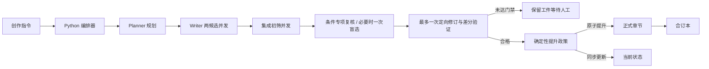

<p align="center">
  
</p>

# 《神秘复苏前传：张洞传》

一个由 Planner、Writer 与 Reviewer 协作驱动的长篇小说创作系统，也是一部以张洞为主角、持续更新中的非官方前传故事。

> 从一座封着疑棺的旧祠堂开始，沿着鬼邮局、民国驭鬼者与七老留下的痕迹，写完一条横跨半个世纪的灵异时间线。

## 项目概览

这个仓库同时包含可运行的创作引擎和正式连载正文。系统将“规划、写作、审查”拆成三个独立角色，由 Python 编排器控制状态、上下文和文件写入，避免未通过审查的草稿污染正式章节。

| 能力 | 作用 |
|---|---|
| 质量进化分工 | Planner 规划，Writer 并发生成两份候选，集成 Reviewer 初筛，必要时触发专项复核与一次盲选 |
| 单一真相源 | 当前章号、人物、时间、伏笔和已知规则集中在一个状态文件中 |
| 事务式写作 | 章节、元数据和状态同步提升；任一步骤失败都不改变正式内容 |
| 多层质量门禁 | 静态检查后按连续性、人物、文学性、反 AI 痕迹计分，并用匿名选票交叉验证 |
| 连续性控制 | 最近章节摘要、钩子、人物状态和伏笔在每次规划时进入受控上下文 |
| 可恢复工作区 | 每次尝试保留规划、正文和两类审查报告，支持人工确认后再提升 |

## 创作管线



默认平衡模式把 Planner 在内的所有模型调用限制为最多 10 次：两候选和两次集成初筛构成 5 次基础路径，专项复核最多两次，只有分差接近时才调用一次 Selector，修订与验证必须成对预留且最多一次。失败、超时和无效输出一旦启动 Provider 都计入预算；系统不做无条件补写或外层重新规划。

完整的状态机、文件契约与恢复方式见 [创作引擎手册](init.md)。

## 故事世界

故事从 1908 年的大汉市开始。十八岁的张洞尚未拥有后来压制一代驭鬼者的力量；他首先面对的是祠堂地下越来越松的棺钉、镇上无法对齐的死者数量，以及一套只能靠试错辨认的杀人规律。

### 五卷路线

| 卷 | 章节 | 年代 | 主线 |
|---|---:|---:|---|
| 大汉市 | 1—80 | 1900—1911 | 家族疑棺、张洞起源与第一条灵异规律 |
| 乱世觉醒 | 81—160 | 1912—1927 | 鬼邮局、罗文松与民国灵异秩序的雏形 |
| 七老集结 | 161—320 | 1930—1940 | 七位顶尖驭鬼者相遇、冲突并形成共同选择 |
| 黑暗降临 | 321—460 | 1937—1945 | 大型灵异事件与无法回避的群体代价 |
| 终极抉择 | 461—600 | 1945—1950 | 封印体系、时代退场与留给后世的缺口 |

### 七老与见证者

| 人物 | 故事定位 |
|---|---|
| 张洞 | 从普通青年走向一代驭鬼者的核心人物 |
| 罗文松 | 与鬼邮局和空间灵异相连的管理者 |
| 李庆之 | 棺材匠，承担关押与正面对抗的重量 |
| 孟小董 | 与替死娃娃、过去入侵相关的危险人物 |
| 张幼红 | 身份成谜，在多重身份之间延续自身 |
| 罗千 | 坟场看守者，以坟土限制灵异 |
| 张伯华 | 药铺主人，研究灵异侵蚀与续命边界 |
| 秦老 | 不属于七人小队的天生异类，也是时代的见证者 |

### 灵异底层规则

1. 鬼不能被普通方式彻底杀死，只能限制、关押、转移或暂时规避。
2. 能对付鬼的只有鬼；普通手段最多改变环境或争取时间。
3. 使用灵异力量必然产生具体且不可逆的代价。
4. 每个异常都有相对稳定的规律，但人物的认知永远可能不完整。
5. 新规律必须经过观察、假说、试错和后果，不能由叙述者直接宣布答案。

## 当前进度

- 已完成：第 1—2 章
- 下一章：第 3 章
- 当前事件：大汉市疑棺 · 征兆阶段
- 故事时间：1908 年
- 当前位置：大汉市 · 双桥镇

正式状态以 [`novel/state/current.json`](novel/state/current.json) 为准。

## 开始使用

### 环境要求

- Python 3.10 或更高版本
- 已安装并完成认证的 Codex CLI
- Git

### 获取项目

```bash
git clone https://github.com/cyanrbt/novel-prequel.git
cd novel-prequel
python3 scripts/orchestrator.py status
python3 scripts/orchestrator.py preflight
```

### 安全生成下一章

先使用 dry-run 生成完整工件，不修改正式章节：

```bash
python3 scripts/orchestrator.py next --dry-run
```

`--dry-run` 只是不提升正式文件，仍会真实消耗模型额度。默认 `balanced` 最多 10 次调用；需要更快的单候选人工确认路径时使用：

```bash
python3 scripts/orchestrator.py next --mode fast --dry-run
```

快速模式最多 3 次调用（规划、单候选、集成初筛），不会自动提升。

中断后可按输入和工件哈希恢复，不会重复执行已完成阶段：

```bash
python3 scripts/orchestrator.py next --resume --dry-run
```

恢复只复用状态哈希、工件哈希和模型路由指纹都一致的已完成阶段；中断中的调用会作为已花费失败调用结算。`--resume` 不增加原预算，也不会产生第 11 次调用。旧流程的 `REPLAN` 工作区显示为只读，不能按新版预算恢复。

检查工作区中的规划、正文与审查报告后，提升最近一次通过的尝试：

```bash
python3 scripts/orchestrator.py accept
```

边界稿也可以人工选择一个已通过硬门禁的候选：

```bash
python3 scripts/orchestrator.py accept --candidate 2
```

也可以让通过门禁的尝试直接提升：

```bash
python3 scripts/orchestrator.py next
```

### 审查、合并与恢复

```bash
# 审查最近五章
python3 scripts/orchestrator.py review --last 5

# 为最近两章生成四维只读校准报告
python3 scripts/orchestrator.py review --last 2 --specialists

# 显式执行到期审计；审计使用独立的单次调用预算
python3 scripts/orchestrator.py audit

# 手动执行二十章级阶段复审；只生成报告和未来债务
python3 scripts/orchestrator.py audit --arc

# 从正式章节重建连续阅读合订本
python3 scripts/orchestrator.py merge

# 从通过校验的本地状态备份恢复
python3 scripts/orchestrator.py recover

# 运行自动测试
python3 -m unittest discover -v
```

章节晋级只在 `decision.json` 标记 `audits_due`，不会自动调用审计模型。

### 模型路由与运行状态

- Terra medium：Planner、集成初筛；Terra high：专项复核和复杂验证。
- Sol medium：候选正文与 Selector；Sol high：定向修订。
- Luna high：局部差分验证。
- `WAITING_USER`：已有可检查工件，但自动提升条件不足。
- `BUDGET_EXHAUSTED`：预算已封顶；可无新增调用地查看或人工比较，也可显式创建新预算运行。
- 候选失败时 `decision.md` 会列出失败阶段、已花费调用、当前最佳工件及未自动补写原因。

执行章节生成时，CLI 会逐行显示模型调用开始、完成、失败以及审查工件校验结果：

```bash
python3 scripts/orchestrator.py next --dry-run --mode balanced
```

模型进程正常返回后仍需校验其结构化工件，因此“模型调用完成”和“审查有效”是两个不同状态。无效审查不会被误记为正文硬失败，也不会自动重试；原始输出保存在对应候选目录的 `diagnostics/*.invalid.txt`，最终 CLI 和 `decision.json` 会给出准确路径。

最终摘要中的“实际墙钟耗时”是用户真实等待时间；“并发调用耗时合计”是所有模型调用时长相加，因两个任务可以并发，后者可能明显大于前者。

获批的十次试运行必须逐次由用户启动。至少五次可轮换使用 `--shadow-review`，最后只读汇总：

```bash
python3 scripts/benchmark_pipeline.py \
  --manifest novel/work/chapter_003/attempt_01/run_manifest.json \
  --manifest PATH_02 --manifest PATH_03 --manifest PATH_04 --manifest PATH_05 \
  --manifest PATH_06 --manifest PATH_07 --manifest PATH_08 --manifest PATH_09 \
  --manifest PATH_10
```

汇总脚本不会启动模型；影子专项仍占用单章既有预算，不能突破两次专项或 10 次总上限。

## 项目结构

```text
novel-prequel/
├── README.md                       # 项目入口
├── init.md                         # 创作引擎手册
├── agents/                         # Planner、Writer、Reviewer 指令
├── config/
│   └── prequel_config.json         # 提供方、质量门禁与卷结构
├── schemas/                        # 状态、规划和审查 JSON Schema
├── scripts/
│   ├── orchestrator.py             # 命令行入口
│   ├── merge_chapters.sh           # 合订本辅助脚本
│   └── prequel/                    # 状态、上下文、质量和管线实现
├── tests/                          # 状态、提供方、管线和质量测试
├── docs/assets/                    # README 视觉资产
└── novel/
    ├── chapters/                   # 正式正文与章节元数据
    ├── full_novel.txt              # 连续阅读合订本
    ├── state/current.json          # 当前创作状态
    ├── rules/                      # 权威规则与设定边界
    ├── style/                      # 风格参数与民国语境锚点
    ├── knowledge/                  # 事实等级、长期索引、质量经验与创作债务
    ├── characters/                 # 人物卡
    ├── anomalies/                  # 异常设计卡
    ├── plots/                      # 事件大纲
    ├── world.md                    # 世界背景
    ├── timeline.md                 # 五卷时间线
    └── foreshadow_tracker.md       # 伏笔登记与回收
```

## 质量与连续性

系统不会把“模型有输出”等同于“章节可发布”。正式提升需要同时满足：

- 状态结构、当前事件和正式章号连续；
- 规划引用的事实 ID 已注册，并产生实际状态变化；
- 未解锁能力、现代人物和时代错位词汇没有进入正文；
- 最近五章不存在完整段落复用、累计长句复用或明显场景模板复制；
- 集成初筛及实际触发的专项证据确实存在于正文，各维度达到资格线；
- 双候选接近时一次匿名盲选有效，单合格候选还必须通过连续性专项守卫；
- 章节、元数据和状态能够作为一个整体写入。

规则入口见 [创作规则全书](novel/rules/rulebook.md)，结构化设定边界见 [创作知识索引](novel/knowledge/README.md)。

## 阅读入口

- [第一卷正式章节](novel/chapters/vol_01/)
- [连续阅读合订本](novel/full_novel.txt)
- [张洞人物卡](novel/characters/protagonist.md)
- [事件大纲](novel/plots/)
- [五卷时间线](novel/timeline.md)
- [伏笔追踪表](novel/foreshadow_tracker.md)

## 项目说明

本项目是非官方、非商业的同人创作与长篇写作系统研究。原作及相关权利归各自权利人所有。本仓库不分发原著全文或大段原文摘录，也不以任何形式替代正版阅读。

仓库中的程序、提示词、原创正文和视觉资产具有不同的内容属性；在项目所有者明确授权方式之前，不作统一开源许可声明。
