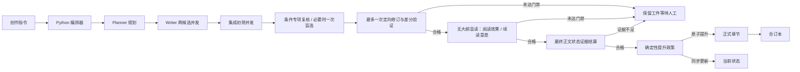

<p align="center">
  
</p>

# 《神秘复苏前传：张洞传》

一个由 Planner、Writer 与 Reviewer 协作驱动的长篇小说创作系统，也是一部以张洞为主角、持续更新中的非官方前传故事。

> 从一座封着疑棺的旧祠堂开始，沿着鬼邮局、民国驭鬼者与七老留下的痕迹，写完一条从辛亥前后延伸至杨间时代的灵异时间线。

## 项目概览

这个仓库同时包含可运行的创作引擎和正式连载正文。系统将“规划、写作、审查”拆成三个独立角色，由 Python 编排器控制状态、上下文和文件写入，避免未通过审查的草稿污染正式章节。

| 能力 | 作用 |
|---|---|
| 质量进化分工 | Planner 先建立读者投入引擎与戏剧脊柱，再维护完整约束账本；Writer 只读取面向故事的精简简报，Reviewer 使用完整账本审计 |
| 单一真相源 | 当前章号、人物、时间、伏笔和已知规则集中在一个状态文件中 |
| 事务式写作 | 章节、元数据和状态同步提升；任一步骤失败都不改变正式内容 |
| 多层质量门禁 | 四维计分后执行无大纲盲读，并以头部同类机制校准人物依恋、主动威胁、主角独特性、揭示变形、情绪余震和真实续读偏好 |
| 累计偏好合同 | 用户已经否定或确认的视角、空间、反应、对白和命名要求进入版本化合同，同时注入规划、写作与审查，不随对话轮次丢失 |
| 场景四账审计 | 程序先枚举认知判断、边界动作、死亡冲击与对白样本；盲读必须逐项给出来源和结论，漏审本身即为无效报告 |
| 可追溯上下文 | 实际注入的规则、风格、人物状态、近期正文均记录来源哈希；未核准锚点不会进入 Writer |
| 证据化状态 | 摘要、钩子、状态变化、伏笔和里程碑必须引用最终正文，不能直接从大纲提交 |
| 可恢复工作区 | 每次尝试保留规划、正文和两类审查报告，支持人工确认后再提升 |

## 创作管线



默认平衡模式把 Planner、盲读者和状态结算器在内的所有模型调用限制为最多 12 次：两候选和两次集成初筛构成 5 次基础路径，专项复核最多两次，只有分差接近时才调用一次 Selector，修订与验证必须成对预留且最多一次；最终盲读与状态结算各预留一次。失败、超时和无效输出一旦启动 Provider 都计入预算；系统不做无条件补写或外层重新规划。

完整的状态机、文件契约与恢复方式见 [创作引擎手册](init.md)。

## 故事世界

故事从1911年前后的双桥镇开始。约十七岁的张洞尚未拥有后来压制一代驭鬼者的力量；他先要从一套会指定活人守位的家族制度中保住家人，再亲手寻找不靠牺牲守位者的限制办法。

地理上，正文使用原著虚构市名“大汉市”统摄现实武汉三镇及其后续城市空间；武昌、汉口、汉阳、江岸作为具体历史片区出现，“大汉市”和“武汉”不另写成两座城市。

六卷主事件、能力代价、七老关系、人皮纸起源、王家与鬼眼展开等级，以及通向原著的留白边界，统一收录于 [全书剧情圣经](novel/plots/full_series_plot_bible.md)。

### 六卷路线

| 卷 | 预估章数 | 年代 | 主线 |
|---|---:|---:|---|
| 门外 | 55—70 | 1911—1914 | 从家族守位制度中活下来，主动寻找不靠牺牲活人的办法 |
| 无主信 | 75—95 | 1914—1927 | 与罗文松从路线冲突走向有限合作，首次主动承担抹除代价 |
| 不同的门 | 105—130 | 1928—1937 | 双桥旧木造成的错门事件串起核心人物，七人在弘法寺门后完成第一次共同限制 |
| 无人守得住 | 90—115 | 1937—1945 | 固定封存面对战争迁徙失效，团队因代价分配而分裂 |
| 留给后来人 | 75—100 | 1945—1953 | 江岸接收总栈终局拆分三段灾链，留下仍需活人维护、可被后来者拒绝的有限遗产 |
| 守到后来 | 45—65 | 1954年至杨间时代 | “最后一个无人接班的位置”随成员退出持续恶化，红门会面与古宅葬礼完成正典交接 |

### 七老与见证者

| 人物 | 故事定位 |
|---|---|
| 张洞 | 从普通青年走向一代驭鬼者的核心人物 |
| 罗文松 | 鬼邮局第一任管理者，代表让风险与责任持续流转的路线 |
| 李庆之 | 与凯撒大酒店高大男尸、无头鬼影及柴刀拼图相连的守门者 |
| 孟小董 | 与替死娃娃、过去入侵相关的危险人物 |
| 张幼红 | 以木偶复制部分灵异，并为多世复活留下安排 |
| 罗千 | 坟场看守者，以坟土限制灵异 |
| 张伯华 | 药铺主人，研究灵异侵蚀与续命边界 |
| 秦老 | 不属于七人小队的天生异类，也是时代的见证者 |
| 沈惟明／人皮纸 | 从真实但不完整的未来记录，走向以人的意识按厉鬼方式驾驭后来者 |

### 灵异底层规则

1. 鬼不能被普通方式彻底杀死，只能限制、关押、转移或暂时规避。
2. 能对付鬼的只有鬼；普通手段最多改变环境或争取时间。
3. 使用灵异力量必然产生具体且不可逆的代价。
4. 每个异常都有相对稳定的规律，但人物的认知永远可能不完整。
5. 新规律必须经过观察、假说、试错和后果，不能由叙述者直接宣布答案。

## 当前进度

正式连载已按1911年、十七岁张洞重启。当前章号、事件、年代和已提升正文以 [`novel/state/current.json`](novel/state/current.json) 与 [`novel/chapters/`](novel/chapters/) 的连续正式文件为准，不在 README 中维护容易失真的副本。撤出的旧稿见 [`novel/archive/`](novel/archive/)。

## 开始使用

### 环境要求

- Python 3.10 或更高版本
- Git
- 默认生产路径需要已安装并完成认证的 Codex CLI
- 可选：AGY、OpenCode 或 Grok CLI。改配置前先用 `models` 确认本机可用模型

### 获取项目

```bash
git clone https://github.com/cyanrbt/novel-prequel.git
cd novel-prequel
python3 scripts/orchestrator.py status
python3 scripts/orchestrator.py preflight
python3 scripts/orchestrator.py models
```

### 安全生成下一章

先使用 dry-run 生成完整工件，不修改正式章节：

```bash
python3 scripts/orchestrator.py next --dry-run
```

`--dry-run` 只是不提升正式文件，仍会真实消耗模型额度。默认 `balanced` 最多 12 次调用；需要更快的单候选人工确认路径时使用：

```bash
python3 scripts/orchestrator.py next --mode fast --dry-run
```

快速模式在盲读与状态证据门禁开启时最多 5 次调用（规划、单候选、集成初筛、盲读、状态结算），始终等待人工确认，不会自动提升。

中断后可按输入和工件哈希恢复，不会重复执行已完成阶段：

```bash
python3 scripts/orchestrator.py next --resume --dry-run
```

恢复只复用状态哈希、工件哈希和模型路由指纹都一致的已完成阶段；中断中的调用会作为已花费失败调用结算。`--resume` 不增加原预算，也不会突破清单记录的调用上限。

检查工作区中的规划、正文与审查报告后，提升最近一次通过的尝试：

```bash
python3 scripts/orchestrator.py accept
```

边界稿也可以人工选择一个已通过硬门禁的候选：

```bash
python3 scripts/orchestrator.py accept --candidate 2
```

也可以让通过门禁的尝试直接提升：

```bash
python3 scripts/orchestrator.py next
```

### 审查、合并与恢复

```bash
# 列出本机已安装的模型提供方
python3 scripts/orchestrator.py models

# 审查最近五章
python3 scripts/orchestrator.py review --last 5

# 为最近两章生成四维只读校准报告
python3 scripts/orchestrator.py review --last 2 --specialists

# 对已发布章节做无大纲盲读
python3 scripts/orchestrator.py reader-review

# 用 Luna 对准备交付的短片段做低成本场景预审
python3 scripts/orchestrator.py demo-review /tmp/demo.txt

# 也可从标准输入读取
printf '待审片段' | python3 scripts/orchestrator.py demo-review - --label 对话样稿

# 把手工精修稿导入可审计尝试，再走同一套语义、盲读与状态审查
python3 scripts/orchestrator.py manual-import PATH --plan-attempt N
python3 scripts/orchestrator.py manual-review --attempt M

# 显式执行到期审计；审计使用独立的单次调用预算
python3 scripts/orchestrator.py audit

# 手动执行二十章级阶段复审；只生成报告和未来债务
python3 scripts/orchestrator.py audit --arc

# 从正式章节重建连续阅读合订本
python3 scripts/orchestrator.py merge

# 从通过校验的本地状态备份恢复
python3 scripts/orchestrator.py recover

# 运行自动测试
python3 -m unittest discover -v
```

章节晋级只在 `decision.json` 标记 `audits_due`，不会自动调用审计模型。

### 模型路由与运行状态

默认生产路由使用 Codex：

- Terra medium：Planner、集成初筛；Terra high：专项复核、盲读、状态结算和复杂验证。
- Sol medium：候选正文与 Selector；Sol high：定向修订。
- Luna high：局部差分验证与短片段交付前场景预审。

引擎同时支持 AGY、OpenCode 和 Grok。先运行 `python3 scripts/orchestrator.py models`，再改 `config/prequel_config.json` 中的 `provider`、`model_profiles` 与 `stage_routes`。

- `status` 会逐章核对正式正文哈希、盲读结果和累计偏好合同版本；任何正式章在审核后被手工改动，都会显示 `STALE` 并阻断下一章生成。
- `WAITING_USER`：已有可检查工件，但自动提升条件不足。
- `BUDGET_EXHAUSTED`：预算已封顶；可无新增调用地查看或人工比较，也可显式创建新预算运行。
- 候选失败时 `decision.md` 会列出失败阶段、已花费调用、当前最佳工件及未自动补写原因。

执行章节生成时，CLI 会逐行显示模型调用开始、完成、失败以及审查工件校验结果：

```bash
python3 scripts/orchestrator.py next --dry-run --mode balanced
```

模型进程正常返回后仍需校验其结构化工件，因此“模型调用完成”和“审查有效”是两个不同状态。无效审查不会被误记为正文硬失败，也不会自动重试；原始输出保存在对应候选目录的 `diagnostics/*.invalid.txt`，最终 CLI 和 `decision.json` 会给出准确路径。

最终摘要中的“实际墙钟耗时”是用户真实等待时间；“并发调用耗时合计”是所有模型调用时长相加，因两个任务可以并发，后者可能明显大于前者。

批量汇总 dry-run 清单：

```bash
python3 scripts/benchmark_pipeline.py --manifest PATH_01 --manifest PATH_02
```

该脚本不启动模型；`--shadow-review` 仍占用单章既有预算，不能突破两次专项或 12 次总上限。

## 项目结构

```text
novel-prequel/
├── README.md                       # 项目入口
├── init.md                         # 创作引擎手册
├── agents/                         # Planner、Writer、Reviewer 指令
├── config/
│   └── prequel_config.json         # 提供方、质量门禁与卷结构
├── schemas/                        # 状态、规划和审查 JSON Schema
├── scripts/
│   ├── orchestrator.py             # 命令行入口
│   ├── merge_chapters.sh           # 合订本辅助脚本
│   └── prequel/                    # 状态、上下文、质量和管线实现
├── tests/                          # 状态、提供方、管线和质量测试
├── docs/assets/                    # README 视觉资产
└── novel/
    ├── chapters/                   # 正式正文与章节元数据
    ├── full_novel.txt              # 连续阅读合订本
    ├── state/current.json          # 当前创作状态
    ├── rules/                      # 权威规则与设定边界
    ├── style/                      # 风格参数与民国语境锚点
    ├── knowledge/                  # 事实等级、长期索引、质量经验与创作债务
    ├── characters/                 # 人物卡
    ├── anomalies/                  # 异常设计卡
    ├── plots/                      # 事件大纲与全书剧情圣经
    ├── reviews/                    # 试读与设定审查
    ├── benchmarks/                 # 文风标杆与 Provider 评测
    ├── archive/                    # 撤出的旧连续性
    ├── world.md                    # 世界背景
    ├── timeline.md                 # 六卷时间线
    └── foreshadow_tracker.md       # 伏笔登记与回收
```

## 质量与连续性

系统不会把“模型有输出”等同于“章节可发布”。正式提升需要同时满足：

- 状态结构、当前事件和正式章号连续；
- 规划引用的事实 ID 已注册，并产生实际状态变化；规划还必须把人物依恋拆成对象、危险前的当场体验、私人意义和将被夺走的内容，把情绪余震拆成具体活人、已发生的伤口、未决选择和谜题所服务的人物处境，再明确主动威胁、青年张洞的欲望—缺点矛盾、揭示变形、非巧合线索取得及戏剧脊柱；
- 超过半数场景或末场只让证据更可靠、人物处境没有改变时，规划直接退回；关键线索若依赖未锁箱柜、恰好掉页或无人看守等高风险巧合，也不得进入正文生成；
- 未解锁能力、现代人物和时代错位词汇没有进入正文；
- 最近五章不存在完整段落复用、累计长句复用或明显场景模板复制；
- 集成初筛及实际触发的专项证据确实存在于正文，各维度达到资格线；
- 双候选接近时一次匿名盲选有效，单合格候选还必须通过连续性专项守卫；
- 无大纲盲读的八项体验分和五项标杆诊断都达到 4/5，竞争力必须为 `MATCH`；`NEAR`、证据主导型奖励或缺乏真实续读偏好均不得提升；
- 盲读者必须用正文唯一引文标出前1000字结果、首个有效压力、核心威胁、首次高代价选择、压力变化、连续解释段和纯信息段；程序重算位置与字数，并强制执行 25% / 30% / 60%、最大800字空档、章末85%、无连续三段解释及无120字以上纯信息段；
- 每项状态变化、伏笔和里程碑都有最终正文逐字证据；摘要与钩子从成稿重新提取；
- 伏笔先播种后回收，里程碑前置条件、所属卷和到期伏笔均通过生命周期检查；
- 章节、元数据和状态能够作为一个整体写入。

规则入口见 [创作规则全书](novel/rules/rulebook.md)，结构化设定边界见 [创作知识索引](novel/knowledge/README.md)。

## 阅读入口

- [第一卷正式章节](novel/chapters/vol_01/)
- [连续阅读合订本](novel/full_novel.txt)
- [全书剧情圣经](novel/plots/full_series_plot_bible.md)
- [张洞人物卡](novel/characters/protagonist.md)
- [事件大纲](novel/plots/)
- [六卷时间线](novel/timeline.md)
- [伏笔追踪表](novel/foreshadow_tracker.md)

## 项目说明

本项目是非官方、非商业的同人创作与长篇写作系统研究。原作及相关权利归各自权利人所有。本仓库不分发原著全文或大段原文摘录，也不以任何形式替代正版阅读。

仓库中的程序、提示词、原创正文和视觉资产具有不同的内容属性；在项目所有者明确授权方式之前，不作统一开源许可声明。
